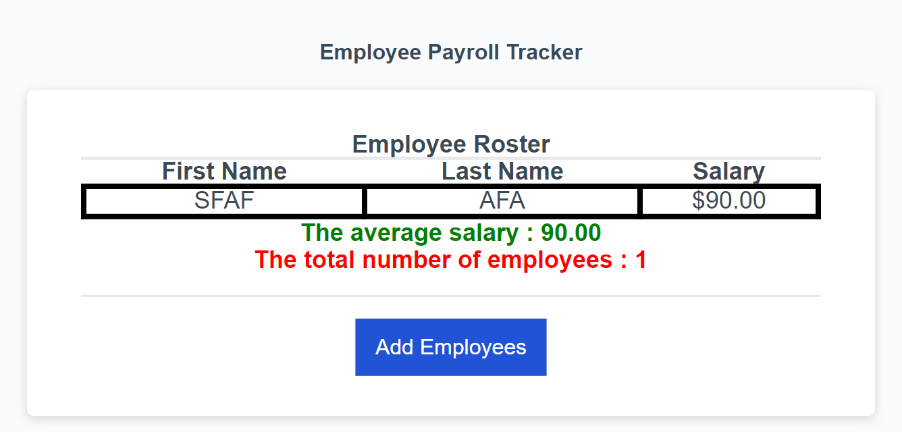

# Employee-Payroll

```
BootCamp 2024 Challenge 3
```

## User Story

```
AS A payroll manager wants to track employees payroll
SO THAT user can see my employees' payroll data and properly budget for the company
```

## Acceptance Criteria

```
WHEN button "Add employees" is clicked
THEN a series of prompts will be shown to the user asking to enter the details of the employees : first name, last name, and salary
AFTER adding the information of the each employee
A prompt will be shown to ask for adding more employees
WHEN user chose to continue to add more employees
THEN SERIES of prompts will be shown again
WHEN user choses not to add more employees
THEN EMPLOYEES data will be displayed
```

## links

```
Rep : https://github.com/usachdeva/Employee-Payroll

Deployment : https://usachdeva.github.io/Employee-Payroll/
```

## Screenshot

```

```
